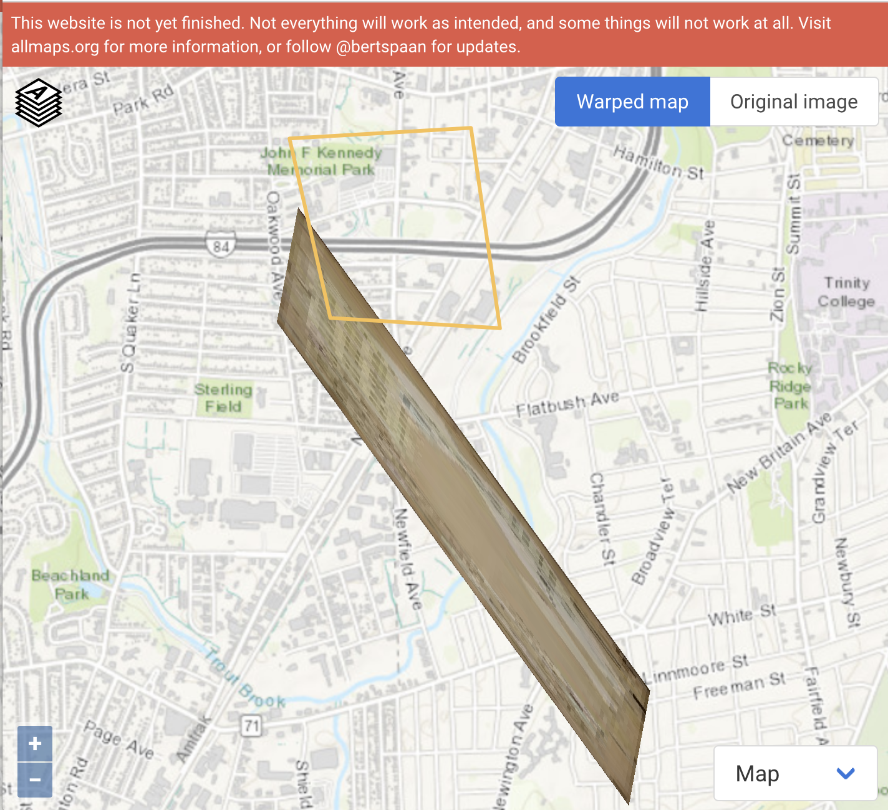

# otl-public-housing
Leaflet interactive historical map of public housing projects in metro Hartford CT

## Sources
US Library of Congress, “Sanborn Fire Insurance Maps Online Checklist,” https://www.loc.gov/rr/geogmap/sanborn/.

- Hartford volume 1, 1922-1950 https://www.loc.gov/item/sanborn01132_009/
- Hartford volume 2, 1922-1950 https://www.loc.gov/item/sanborn01132_010/ (not yet available as of June 2021).
- Hartford volume 3, 1923-1950 https://www.loc.gov/item/sanborn01132_011/
- Hartford volume 4, 1923-1950 https://www.loc.gov/item/sanborn01132_012/ (not yet available as of June 2021).

Sanborn Map Company, Insurance Maps of Hartford Connecticut (New York: Sanborn Map Co, 1922-1961), images digitized from Connecticut State Library, https://cscu-csl-primo.hosted.exlibrisgroup.com/permalink/f/1aj269h/01CSCU_NETWORK_ALMA7176213960003451.

- https://github.com/ontheline/otl-sanborn-1961-hartford-vol1
- https://github.com/ontheline/otl-sanborn-1961-hartford-vol2
- https://github.com/ontheline/otl-sanborn-1961-hartford-vol3
- https://github.com/ontheline/otl-sanborn-1961-hartford-vol4

## File structure

- from LOC download large JPG2000, convert to JPG
- Georeferenced in https://mapwarper.net, and exported XYZ link and GeoTIFF files

### West Hartford
Elmwood Acres (east), USHA Project
- on Sanborn 1950 page 353 https://www.loc.gov/resource/g3784hm.g3784hm_g01132195003/?sp=55
- https://mapwarper.net/maps/tile/57925/{z}/{x}/{y}.png
- 1950-353.tif
- on Sanborn 1961 page 353 (pasted over)

Elmwood Acres (west), USHA Project
- on Sanborn 1950 page 352 https://www.loc.gov/resource/g3784hm.g3784hm_g01132195003/?sp=54
- https://mapwarper.net/maps/tile/57926/{z}/{x}/{y}.png
- 1950-352.tif
- on Sanborn 1961 page 352 (pasted over)

Oakwood Acres, USHA Project Temporary War Housing
- on Sanborn 1950 page 344 https://www.loc.gov/resource/g3784hm.g3784hm_g01132195003/?sp=46
- https://mapwarper.net/maps/tile/57874/{z}/{x}/{y}.png
- 1950-344.tif
- on Sanborn 1961 page 344 (pasted over)

South Quaker Terrace (north), USHA Project Temporary War Housing
- on Sanborn 1950 page 342 https://www.loc.gov/resource/g3784hm.g3784hm_g01132195003/?sp=44
- https://mapwarper.net/maps/tile/57923/{z}/{x}/{y}.png
- 1950-342.tif

South Quaker Terrace (south), USHA Project Temporary War Housing
- on Sanborn 1950 page 366 https://www.loc.gov/resource/g3784hm.g3784hm_g01132195003/?sp=58
- https://mapwarper.net/maps/tile/57924/{z}/{x}/{y}.png
- 1950-366.tif

Mosaic of five 1950 West Hartford public housing maps above
- https://mapwarper.net/mosaics/tile/1411/{z}/{x}/{y}.png

### Hartford
Airport Homes
- NOT yet in Sanborn map: see Brainard Road area, vacated July 1, 1950, so would be Sanborn 1950 vol 2 (not yet available)
- POSSIBLY cluster of homes in USGS Topographical Map, Hartford South CT, 1944 https://ngmdb.usgs.gov/topoview/viewer/#12/41.6876/-72.6870
- 1944-hartford-south-usgs.jpg

Bowles Park, state housing
- should not appear yet in Sanborn 1950
- Sanborn 1961 page 463 https://github.com/ontheline/otl-sanborn-1961-hartford-vol4

Blue Hills Homes, USHA project?
- Sanborn 1950 page 425 ??? NOT YET AVAILABLE
- Sanborn 1961 page 425 (pasted over) https://github.com/ontheline/otl-sanborn-1961-hartford-vol4

Charter Oak Terrace ABC, USHA project
- Sanborn 1950 page 318 https://www.loc.gov/resource/g3784hm.g3784hm_g01132195003/?sp=19
- https://mapwarper.net/maps/tile/57938/{z}/{x}/{y}.png
- 1950-318.tif
- Sanborn 1961 page 318 https://github.com/ontheline/otl-sanborn-1961-hartford-vol3

Charter Oak Terrace D and Extension (E South), USHA project
- Sanborn 1950 page 326 https://www.loc.gov/resource/g3784hm.g3784hm_g01132195003/?sp=24
- https://mapwarper.net/maps/tile/57941/{z}/{x}/{y}.png
- 1950-326.tif
- Sanborn 1961 page 326 https://github.com/ontheline/otl-sanborn-1961-hartford-vol3

Dutch Point Colony, USHA project
- Sanborn 1950 page 236 ??? NOT YET AVAILABLE
- Sanborn 1961 page 236 https://github.com/ontheline/otl-sanborn-1961-hartford-vol2

Rice Heights, state housing project, and Charter Oak Terrace Extension (E North)
- Sanborn 1950 page 319 https://www.loc.gov/resource/g3784hm.g3784hm_g01132195003/?sp=20
- https://mapwarper.net/maps/tile/57942/{z}/{x}/{y}.png
- 1950-319.tif
- Sanborn 1961 page 319 https://github.com/ontheline/otl-sanborn-1961-hartford-vol3

Westbrook Village, state housing
- will not appear in 1950
- Sanborn 1961 page 462 https://github.com/ontheline/otl-sanborn-1961-hartford-vol4

Bellevue Square, USHA project, 1940-41-42
- Sanborn 1950 page 53 https://www.loc.gov/resource/g3784hm.g3784hm_g01132195001/?sp=68
- Note that page 54 contains three buildings that are duplicated from page 53
- https://mapwarper.net/maps/tile/57943/{z}/{x}/{y}.png
- 1950-53.tif
- Sanborn 1961 page 53 https://github.com/ontheline/otl-sanborn-1961-hartford-vol1

Mahoney Village
- will not appear in 1950 or 1961 map

Nelton Court, USHA project
- Sanborn 1950 page 65 https://www.loc.gov/resource/g3784hm.g3784hm_g01132195001/?sp=80
- https://mapwarper.net/maps/tile/57944/{z}/{x}/{y}.png
- 1950-65.tif
- Sanborn 1961 page 65 https://github.com/ontheline/otl-sanborn-1961-hartford-vol1

Stowe Village, Hartford housing authority
- will not appear in Sanborn 1950
- Sanborn 1961 page 85 https://github.com/ontheline/otl-sanborn-1961-hartford-vol1
- Sanborn 1961 page 86 https://github.com/ontheline/otl-sanborn-1961-hartford-vol1

### Hartford projects, in order of occupancy
- Nelton Court, 1 Feb 1941
- Dutch Point Colony, 1 March 1941
- Bellevue Square, 21 July 1941
- Charter Oak Terrace ABD and D, 29 Oct 1941
- Blue Hills Homes, 31 Aug 1943; vacated 30 June 1955
- Charter Oak Terrace Extension, 7 January 1944; demolished Dec 1953
- Airport Homes, 1944?; vacated July 1950
- Rice Heights, 1 Sept 1949
- Bowles Park, 1 July 1950
- Westbrook Village, 7 Feb 1951
- Stowe Village, 25 Feb 1953
- Mahoney Village, 9 Jan 1963 (not shown in 1961 Sanborn map: south of Keney Park)
- Smith Towers YEAR? (not shown in 1961 Sanborn map; Sheldon-Charter Oak)
- Kent Apartments YEAR? (not shown in 1961 Sanborn map)
- Betty Knox Apartments YEAR? (not shown in 1961 Sanborn map)
- Mary Shepard Place YEAR? (not shown in 1961 Sanborn map)

Sources on list and dates: Jessica Rivera notes for CT Fair Housing Center, Nov 2011; Hartford Housing Authority site map from web, 2002; both in this GitHub repository.

## East Hartford

Mayberry Village @FavorsWarHome1944

North End Homes @FavorsWarHome1944

## Wethersfield

Westview Homes @FavorsWarHome1944

## Quick Comparison
1950-1961-oakwoodacres-sanborn.png in otl-bookdown/images

## See also
UConn Greenhouse Studios 2020 visual created by James Kolb for Hartford Housing project [Twitter post](https://twitter.com/GreenhouseUConn/status/1281672946734567425), based on Commission on the City Plan, Community Renewal program, 1965

## Problems with AllMaps testing as of June 2021
-  for multi-page IIIF images (such as Sanborn map book pages in the LOC collection), the tool currently leaves in place georeference points from prior pages. In other words, points 1-7 from map page 46 are *still* in the same spot when I try to georeference map page 47. Developer needs to find a way to treat pages from the same IIIF manifest as separate images.
- also frustrating that once you’ve placed a georeference marker on the screen, there is no way that I can find to delete it.

### Add Library of Congress items IIIF manifest link to Editor

https://www.loc.gov/item/sanborn01132_011/manifest.json

### Georeference in Editor
https://allmaps.org/editor/#/georeference?url=https%3A%2F%2Fwww.loc.gov%2Fitem%2Fsanborn01132_011%2Fmanifest.json&image=5eYuKJgRqEcMRCzG

### Copied annotation from the Editor:

{
  "type": "Annotation",
  "@context": [
    "http://geojson.org/geojson-ld/geojson-context.jsonld",
    "http://iiif.io/api/presentation/3/context.json"
  ],
  "motivation": "georeference",
  "target": {
    "type": "Image",
    "source": "https://tile.loc.gov/image-services/iiif/service:gmd:gmd378m:g3784m:g3784hm:g3784hm_g01132195003:01132_03_1950-0344/full/full/0/default.jpg",
    "service": [
      {
        "@id": "https://tile.loc.gov/image-services/iiif/service:gmd:gmd378m:g3784m:g3784hm:g3784hm_g01132195003:01132_03_1950-0344",
        "type": "ImageService2",
        "profile": "http://iiif.io/api/image/2/level2.json"
      }
    ],
    "selector": {
      "type": "SvgSelector",
      "value": "<svg width=\"6672\" height=\"7796\"><polygon points=\"0,0 0,7796 6672,7796 6672,0 0,0\" /></svg>"
    }
  },
  "body": {
    "type": "FeatureCollection",
    "features": [
      {
        "type": "Feature",
        "id": "ir7Hk8MVUzwpK6WT",
        "properties": {
          "image": [
            641,
            7347
          ]
        },
        "geometry": {
          "type": "Point",
          "coordinates": [
            -72.7215224,
            41.7481307
          ]
        }
      },
      {
        "type": "Feature",
        "id": "ugEQUqeAVQ82F3D4",
        "properties": {
          "image": [
            516,
            6199
          ]
        },
        "geometry": {
          "type": "Point",
          "coordinates": [
            -72.7215975,
            41.7491312
          ]
        }
      },
      {
        "type": "Feature",
        "id": "SXLyBDT73mYZ4U2S",
        "properties": {
          "image": [
            336,
            3589
          ]
        },
        "geometry": {
          "type": "Point",
          "coordinates": [
            -72.7217799,
            41.7513244
          ]
        }
      },
      {
        "type": "Feature",
        "id": "c5LsTQyQBM3XNyXV",
        "properties": {
          "image": [
            282,
            2051
          ]
        },
        "geometry": {
          "type": "Point",
          "coordinates": [
            -72.7219301,
            41.7528212
          ]
        }
      },
      {
        "type": "Feature",
        "id": "cKu4vJiubVwERWuW",
        "properties": {
          "image": [
            258,
            676
          ]
        },
        "geometry": {
          "type": "Point",
          "coordinates": [
            -72.7220159,
            41.7540538
          ]
        }
      },
      {
        "type": "Feature",
        "id": "78KKy8CCYS5hxaew",
        "properties": {
          "image": [
            5836,
            7167
          ]
        },
        "geometry": {
          "type": "Point",
          "coordinates": [
            -72.7151817,
            41.7482587
          ]
        }
      },
      {
        "type": "Feature",
        "id": "beWA4zneyawkPQzm",
        "properties": {
          "image": [
            5898,
            6230
          ]
        },
        "geometry": {
          "type": "Point",
          "coordinates": [
            -72.7151602,
            41.7491632
          ]
        }
      }
    ]
  }
}

### Pasted annotation into the Viewer, which did not display properly warped map in Firefox or Safari browser:

https://viewer.allmaps.org/#data=data%3Aapplication%2Fjson%2C%7B%0A++%22type%22%3A+%22Annotation%22%2C%0A++%22%40context%22%3A+%5B%0A++++%22http%3A%2F%2Fgeojson.org%2Fgeojson-ld%2Fgeojson-context.jsonld%22%2C%0A++++%22http%3A%2F%2Fiiif.io%2Fapi%2Fpresentation%2F3%2Fcontext.json%22%0A++%5D%2C%0A++%22motivation%22%3A+%22georeference%22%2C%0A++%22target%22%3A+%7B%0A++++%22type%22%3A+%22Image%22%2C%0A++++%22source%22%3A+%22https%3A%2F%2Ftile.loc.gov%2Fimage-services%2Fiiif%2Fservice%3Agmd%3Agmd378m%3Ag3784m%3Ag3784hm%3Ag3784hm_g01132195003%3A01132_03_1950-0344%2Ffull%2Ffull%2F0%2Fdefault.jpg%22%2C%0A++++%22service%22%3A+%5B%0A++++++%7B%0A++++++++%22%40id%22%3A+%22https%3A%2F%2Ftile.loc.gov%2Fimage-services%2Fiiif%2Fservice%3Agmd%3Agmd378m%3Ag3784m%3Ag3784hm%3Ag3784hm_g01132195003%3A01132_03_1950-0344%22%2C%0A++++++++%22type%22%3A+%22ImageService2%22%2C%0A++++++++%22profile%22%3A+%22http%3A%2F%2Fiiif.io%2Fapi%2Fimage%2F2%2Flevel2.json%22%0A++++++%7D%0A++++%5D%2C%0A++++%22selector%22%3A+%7B%0A++++++%22type%22%3A+%22SvgSelector%22%2C%0A++++++%22value%22%3A+%22%3Csvg+width%3D%5C%226672%5C%22+height%3D%5C%227796%5C%22%3E%3Cpolygon+points%3D%5C%220%2C0+0%2C7796+6672%2C7796+6672%2C0+0%2C0%5C%22+%2F%3E%3C%2Fsvg%3E%22%0A++++%7D%0A++%7D%2C%0A++%22body%22%3A+%7B%0A++++%22type%22%3A+%22FeatureCollection%22%2C%0A++++%22features%22%3A+%5B%0A++++++%7B%0A++++++++%22type%22%3A+%22Feature%22%2C%0A++++++++%22id%22%3A+%22ir7Hk8MVUzwpK6WT%22%2C%0A++++++++%22properties%22%3A+%7B%0A++++++++++%22image%22%3A+%5B%0A++++++++++++641%2C%0A++++++++++++7347%0A++++++++++%5D%0A++++++++%7D%2C%0A++++++++%22geometry%22%3A+%7B%0A++++++++++%22type%22%3A+%22Point%22%2C%0A++++++++++%22coordinates%22%3A+%5B%0A++++++++++++-72.7215224%2C%0A++++++++++++41.7481307%0A++++++++++%5D%0A++++++++%7D%0A++++++%7D%2C%0A++++++%7B%0A++++++++%22type%22%3A+%22Feature%22%2C%0A++++++++%22id%22%3A+%22ugEQUqeAVQ82F3D4%22%2C%0A++++++++%22properties%22%3A+%7B%0A++++++++++%22image%22%3A+%5B%0A++++++++++++516%2C%0A++++++++++++6199%0A++++++++++%5D%0A++++++++%7D%2C%0A++++++++%22geometry%22%3A+%7B%0A++++++++++%22type%22%3A+%22Point%22%2C%0A++++++++++%22coordinates%22%3A+%5B%0A++++++++++++-72.7215975%2C%0A++++++++++++41.7491312%0A++++++++++%5D%0A++++++++%7D%0A++++++%7D%2C%0A++++++%7B%0A++++++++%22type%22%3A+%22Feature%22%2C%0A++++++++%22id%22%3A+%22SXLyBDT73mYZ4U2S%22%2C%0A++++++++%22properties%22%3A+%7B%0A++++++++++%22image%22%3A+%5B%0A++++++++++++336%2C%0A++++++++++++3589%0A++++++++++%5D%0A++++++++%7D%2C%0A++++++++%22geometry%22%3A+%7B%0A++++++++++%22type%22%3A+%22Point%22%2C%0A++++++++++%22coordinates%22%3A+%5B%0A++++++++++++-72.7217799%2C%0A++++++++++++41.7513244%0A++++++++++%5D%0A++++++++%7D%0A++++++%7D%2C%0A++++++%7B%0A++++++++%22type%22%3A+%22Feature%22%2C%0A++++++++%22id%22%3A+%22c5LsTQyQBM3XNyXV%22%2C%0A++++++++%22properties%22%3A+%7B%0A++++++++++%22image%22%3A+%5B%0A++++++++++++282%2C%0A++++++++++++2051%0A++++++++++%5D%0A++++++++%7D%2C%0A++++++++%22geometry%22%3A+%7B%0A++++++++++%22type%22%3A+%22Point%22%2C%0A++++++++++%22coordinates%22%3A+%5B%0A++++++++++++-72.7219301%2C%0A++++++++++++41.7528212%0A++++++++++%5D%0A++++++++%7D%0A++++++%7D%2C%0A++++++%7B%0A++++++++%22type%22%3A+%22Feature%22%2C%0A++++++++%22id%22%3A+%22cKu4vJiubVwERWuW%22%2C%0A++++++++%22properties%22%3A+%7B%0A++++++++++%22image%22%3A+%5B%0A++++++++++++258%2C%0A++++++++++++676%0A++++++++++%5D%0A++++++++%7D%2C%0A++++++++%22geometry%22%3A+%7B%0A++++++++++%22type%22%3A+%22Point%22%2C%0A++++++++++%22coordinates%22%3A+%5B%0A++++++++++++-72.7220159%2C%0A++++++++++++41.7540538%0A++++++++++%5D%0A++++++++%7D%0A++++++%7D%2C%0A++++++%7B%0A++++++++%22type%22%3A+%22Feature%22%2C%0A++++++++%22id%22%3A+%2278KKy8CCYS5hxaew%22%2C%0A++++++++%22properties%22%3A+%7B%0A++++++++++%22image%22%3A+%5B%0A++++++++++++5836%2C%0A++++++++++++7167%0A++++++++++%5D%0A++++++++%7D%2C%0A++++++++%22geometry%22%3A+%7B%0A++++++++++%22type%22%3A+%22Point%22%2C%0A++++++++++%22coordinates%22%3A+%5B%0A++++++++++++-72.7151817%2C%0A++++++++++++41.7482587%0A++++++++++%5D%0A++++++++%7D%0A++++++%7D%2C%0A++++++%7B%0A++++++++%22type%22%3A+%22Feature%22%2C%0A++++++++%2
