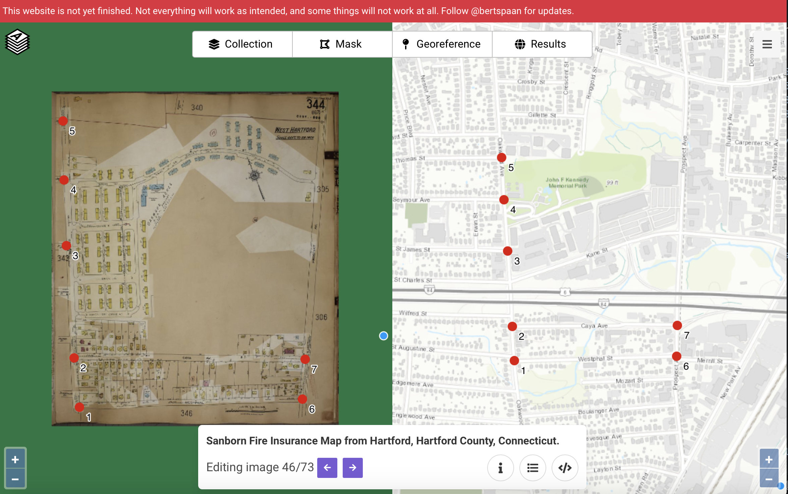

# otl-public-housing
Leaflet interactive historical map of public housing projects in metro Hartford CT

## Sources
Sanborn Fire Insurance Map from Hartford, 1922-1950, digitized by Library of Congress

- West Hartford
  - Elmwood Acres https://www.loc.gov/resource/g3784hm.g3784hm_g01132195003/?sp=55
  - Oakwood Acres https://www.loc.gov/resource/g3784hm.g3784hm_g01132195003/?sp=46
  - South Quaker Terrace (north section) https://www.loc.gov/resource/g3784hm.g3784hm_g01132195003/?sp=44
  - South Quaker Terrace (south section) https://www.loc.gov/resource/g3784hm.g3784hm_g01132195003/?sp=58
- Hartford
  - Charter Oak Terrace https://www.loc.gov/resource/g3784hm.g3784hm_g01132195003/?sp=24

more to come

## AllMaps testing

### Georeferenced in Editor
https://allmaps.org/editor/#/georeference?url=https%3A%2F%2Fwww.loc.gov%2Fitem%2Fsanborn01132_011%2Fmanifest.json&image=5eYuKJgRqEcMRCzG

### Annotation copied from Editor:

{
  "type": "Annotation",
  "@context": [
    "http://geojson.org/geojson-ld/geojson-context.jsonld",
    "http://iiif.io/api/presentation/3/context.json"
  ],
  "motivation": "georeference",
  "target": {
    "type": "Image",
    "source": "https://tile.loc.gov/image-services/iiif/service:gmd:gmd378m:g3784m:g3784hm:g3784hm_g01132195003:01132_03_1950-0344/full/full/0/default.jpg",
    "service": [
      {
        "@id": "https://tile.loc.gov/image-services/iiif/service:gmd:gmd378m:g3784m:g3784hm:g3784hm_g01132195003:01132_03_1950-0344",
        "type": "ImageService2",
        "profile": "http://iiif.io/api/image/2/level2.json"
      }
    ],
    "selector": {
      "type": "SvgSelector",
      "value": "<svg width=\"6672\" height=\"7796\"><polygon points=\"0,0 0,7796 6672,7796 6672,0 0,0\" /></svg>"
    }
  },
  "body": {
    "type": "FeatureCollection",
    "features": [
      {
        "type": "Feature",
        "id": "ir7Hk8MVUzwpK6WT",
        "properties": {
          "image": [
            641,
            7347
          ]
        },
        "geometry": {
          "type": "Point",
          "coordinates": [
            -72.7215224,
            41.7481307
          ]
        }
      },
      {
        "type": "Feature",
        "id": "ugEQUqeAVQ82F3D4",
        "properties": {
          "image": [
            516,
            6199
          ]
        },
        "geometry": {
          "type": "Point",
          "coordinates": [
            -72.7215975,
            41.7491312
          ]
        }
      },
      {
        "type": "Feature",
        "id": "SXLyBDT73mYZ4U2S",
        "properties": {
          "image": [
            336,
            3589
          ]
        },
        "geometry": {
          "type": "Point",
          "coordinates": [
            -72.7217799,
            41.7513244
          ]
        }
      },
      {
        "type": "Feature",
        "id": "c5LsTQyQBM3XNyXV",
        "properties": {
          "image": [
            282,
            2051
          ]
        },
        "geometry": {
          "type": "Point",
          "coordinates": [
            -72.7219301,
            41.7528212
          ]
        }
      },
      {
        "type": "Feature",
        "id": "cKu4vJiubVwERWuW",
        "properties": {
          "image": [
            258,
            676
          ]
        },
        "geometry": {
          "type": "Point",
          "coordinates": [
            -72.7220159,
            41.7540538
          ]
        }
      },
      {
        "type": "Feature",
        "id": "78KKy8CCYS5hxaew",
        "properties": {
          "image": [
            5836,
            7167
          ]
        },
        "geometry": {
          "type": "Point",
          "coordinates": [
            -72.7151817,
            41.7482587
          ]
        }
      },
      {
        "type": "Feature",
        "id": "beWA4zneyawkPQzm",
        "properties": {
          "image": [
            5898,
            6230
          ]
        },
        "geometry": {
          "type": "Point",
          "coordinates": [
            -72.7151602,
            41.7491632
          ]
        }
      }
    ]
  }
}

### Produced annotation below, which did not display properly warped map in Viewer:

https://viewer.allmaps.org/#data=data%3Aapplication%2Fjson%2C%7B%0A++%22type%22%3A+%22Annotation%22%2C%0A++%22%40context%22%3A+%5B%0A++++%22http%3A%2F%2Fgeojson.org%2Fgeojson-ld%2Fgeojson-context.jsonld%22%2C%0A++++%22http%3A%2F%2Fiiif.io%2Fapi%2Fpresentation%2F3%2Fcontext.json%22%0A++%5D%2C%0A++%22motivation%22%3A+%22georeference%22%2C%0A++%22target%22%3A+%7B%0A++++%22type%22%3A+%22Image%22%2C%0A++++%22source%22%3A+%22https%3A%2F%2Ftile.loc.gov%2Fimage-services%2Fiiif%2Fservice%3Agmd%3Agmd378m%3Ag3784m%3Ag3784hm%3Ag3784hm_g01132195003%3A01132_03_1950-0344%2Ffull%2Ffull%2F0%2Fdefault.jpg%22%2C%0A++++%22service%22%3A+%5B%0A++++++%7B%0A++++++++%22%40id%22%3A+%22https%3A%2F%2Ftile.loc.gov%2Fimage-services%2Fiiif%2Fservice%3Agmd%3Agmd378m%3Ag3784m%3Ag3784hm%3Ag3784hm_g01132195003%3A01132_03_1950-0344%22%2C%0A++++++++%22type%22%3A+%22ImageService2%22%2C%0A++++++++%22profile%22%3A+%22http%3A%2F%2Fiiif.io%2Fapi%2Fimage%2F2%2Flevel2.json%22%0A++++++%7D%0A++++%5D%2C%0A++++%22selector%22%3A+%7B%0A++++++%22type%22%3A+%22SvgSelector%22%2C%0A++++++%22value%22%3A+%22%3Csvg+width%3D%5C%226672%5C%22+height%3D%5C%227796%5C%22%3E%3Cpolygon+points%3D%5C%220%2C0+0%2C7796+6672%2C7796+6672%2C0+0%2C0%5C%22+%2F%3E%3C%2Fsvg%3E%22%0A++++%7D%0A++%7D%2C%0A++%22body%22%3A+%7B%0A++++%22type%22%3A+%22FeatureCollection%22%2C%0A++++%22features%22%3A+%5B%0A++++++%7B%0A++++++++%22type%22%3A+%22Feature%22%2C%0A++++++++%22id%22%3A+%22ir7Hk8MVUzwpK6WT%22%2C%0A++++++++%22properties%22%3A+%7B%0A++++++++++%22image%22%3A+%5B%0A++++++++++++641%2C%0A++++++++++++7347%0A++++++++++%5D%0A++++++++%7D%2C%0A++++++++%22geometry%22%3A+%7B%0A++++++++++%22type%22%3A+%22Point%22%2C%0A++++++++++%22coordinates%22%3A+%5B%0A++++++++++++-72.7215224%2C%0A++++++++++++41.7481307%0A++++++++++%5D%0A++++++++%7D%0A++++++%7D%2C%0A++++++%7B%0A++++++++%22type%22%3A+%22Feature%22%2C%0A++++++++%22id%22%3A+%22ugEQUqeAVQ82F3D4%22%2C%0A++++++++%22properties%22%3A+%7B%0A++++++++++%22image%22%3A+%5B%0A++++++++++++516%2C%0A++++++++++++6199%0A++++++++++%5D%0A++++++++%7D%2C%0A++++++++%22geometry%22%3A+%7B%0A++++++++++%22type%22%3A+%22Point%22%2C%0A++++++++++%22coordinates%22%3A+%5B%0A++++++++++++-72.7215975%2C%0A++++++++++++41.7491312%0A++++++++++%5D%0A++++++++%7D%0A++++++%7D%2C%0A++++++%7B%0A++++++++%22type%22%3A+%22Feature%22%2C%0A++++++++%22id%22%3A+%22SXLyBDT73mYZ4U2S%22%2C%0A++++++++%22properties%22%3A+%7B%0A++++++++++%22image%22%3A+%5B%0A++++++++++++336%2C%0A++++++++++++3589%0A++++++++++%5D%0A++++++++%7D%2C%0A++++++++%22geometry%22%3A+%7B%0A++++++++++%22type%22%3A+%22Point%22%2C%0A++++++++++%22coordinates%22%3A+%5B%0A++++++++++++-72.7217799%2C%0A++++++++++++41.7513244%0A++++++++++%5D%0A++++++++%7D%0A++++++%7D%2C%0A++++++%7B%0A++++++++%22type%22%3A+%22Feature%22%2C%0A++++++++%22id%22%3A+%22c5LsTQyQBM3XNyXV%22%2C%0A++++++++%22properties%22%3A+%7B%0A++++++++++%22image%22%3A+%5B%0A++++++++++++282%2C%0A++++++++++++2051%0A++++++++++%5D%0A++++++++%7D%2C%0A++++++++%22geometry%22%3A+%7B%0A++++++++++%22type%22%3A+%22Point%22%2C%0A++++++++++%22coordinates%22%3A+%5B%0A++++++++++++-72.7219301%2C%0A++++++++++++41.7528212%0A++++++++++%5D%0A++++++++%7D%0A++++++%7D%2C%0A++++++%7B%0A++++++++%22type%22%3A+%22Feature%22%2C%0A++++++++%22id%22%3A+%22cKu4vJiubVwERWuW%22%2C%0A++++++++%22properties%22%3A+%7B%0A++++++++++%22image%22%3A+%5B%0A++++++++++++258%2C%0A++++++++++++676%0A++++++++++%5D%0A++++++++%7D%2C%0A++++++++%22geometry%22%3A+%7B%0A++++++++++%22type%22%3A+%22Point%22%2C%0A++++++++++%22coordinates%22%3A+%5B%0A++++++++++++-72.7220159%2C%0A++++++++++++41.7540538%0A++++++++++%5D%0A++++++++%7D%0A++++++%7D%2C%0A++++++%7B%0A++++++++%22type%22%3A+%22Feature%22%2C%0A++++++++%22id%22%3A+%2278KKy8CCYS5hxaew%22%2C%0A++++++++%22properties%22%3A+%7B%0A++++++++++%22image%22%3A+%5B%0A++++++++++++5836%2C%0A++++++++++++7167%0A++++++++++%5D%0A++++++++%7D%2C%0A++++++++%22geometry%22%3A+%7B%0A++++++++++%22type%22%3A+%22Point%22%2C%0A++++++++++%22coordinates%22%3A+%5B%0A++++++++++++-72.7151817%2C%0A++++++++++++41.7482587%0A++++++++++%5D%0A++++++++%7D%0A++++++%7D%2C%0A++++++%7B%0A++++++++%22type%22%3A+%22Feature%22%2C%0A++++++++%2
