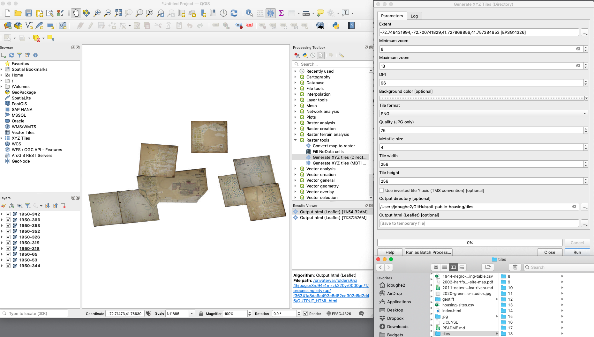

# otl-public-housing
Leaflet interactive historical map of public housing projects in metro Hartford CT

## testing tiles
- hosted on GitHub Pages https://ontheline.github.io/otl-public-housing/
- hosted on Trinity Domains https://jackdougherty.domains.trincoll.edu/otl-map-tiles/public-housing/

- test georaster-layer-for-leaflet https://ontheline.github.io/otl-public-housing/georaster-layer.html
- learn more https://github.com/GeoTIFF/georaster-layer-for-leaflet

## Sources
US Library of Congress, “Sanborn Fire Insurance Maps Online Checklist,” https://www.loc.gov/rr/geogmap/sanborn/.

- Hartford volume 1, 1922-1950 https://www.loc.gov/item/sanborn01132_009/
- Hartford volume 2, 1922-1950 https://www.loc.gov/item/sanborn01132_010/ (not yet available as of June 2021).
- Hartford volume 3, 1923-1950 https://www.loc.gov/item/sanborn01132_011/
- Hartford volume 4, 1923-1950 https://www.loc.gov/item/sanborn01132_012/ (not yet available as of June 2021).

Sanborn Map Company, Insurance Maps of Hartford Connecticut (New York: Sanborn Map Co, 1922-1961), images digitized from Connecticut State Library, https://cscu-csl-primo.hosted.exlibrisgroup.com/permalink/f/1aj269h/01CSCU_NETWORK_ALMA7176213960003451.

- https://github.com/ontheline/otl-sanborn-1961-hartford-vol1
- https://github.com/ontheline/otl-sanborn-1961-hartford-vol2
- https://github.com/ontheline/otl-sanborn-1961-hartford-vol3
- https://github.com/ontheline/otl-sanborn-1961-hartford-vol4

US Geological Survey, TopoView map viewer, https://ngmdb.usgs.gov/topoview/, GeoTIFF format (but unclear if relevant housing projects will appear in 1942 surveys, and if so, how to properly import into QGIS).

- 1944 Manchester CT
- 1944 Hartford South, CT
- 1945 Hartford North, CT

See also in this repo:

- 2002 Hartford Housing Authority map
- 2011 Jessica Rivera notes
- [2020 UConn Greenhouse Studios map created by James Kolb for Hartford Housing project](https://twitter.com/GreenhouseUConn/status/1281672946734567425), based on Commission on the City Plan, Community Renewal program, 1965

## West Hartford

### Elmwood Acres
- on Sanborn 1950 page 353 (east) https://www.loc.gov/resource/g3784hm.g3784hm_g01132195003/?sp=55
- https://mapwarper.net/maps/tile/57925/{z}/{x}/{y}.png
- 1950-353.tif
- on Sanborn 1961 page 353 (text pasted over, same homes)
- on Sanborn 1950 page 352 (west) https://www.loc.gov/resource/g3784hm.g3784hm_g01132195003/?sp=54
- https://mapwarper.net/maps/tile/57926/{z}/{x}/{y}.png
- 1950-352.tif
- on Sanborn 1961 page 352 (pasted over, same homes)

### Oakwood Acres
- on Sanborn 1950 page 344 https://www.loc.gov/resource/g3784hm.g3784hm_g01132195003/?sp=46
- https://mapwarper.net/maps/tile/57874/{z}/{x}/{y}.png
- 1950-344.tif
- on Sanborn 1961 page 344 (pasted over)

### South Quaker Terrace
- on Sanborn 1950 page 342 (north) https://www.loc.gov/resource/g3784hm.g3784hm_g01132195003/?sp=44
- https://mapwarper.net/maps/tile/57923/{z}/{x}/{y}.png
- 1950-342.tif
- on Sanborn 1950 page 366 (south) https://www.loc.gov/resource/g3784hm.g3784hm_g01132195003/?sp=58
- https://mapwarper.net/maps/tile/57924/{z}/{x}/{y}.png
- 1950-366.tif

Mosaic of five 1950 West Hartford public housing maps above
- https://mapwarper.net/mosaics/tile/1411/{z}/{x}/{y}.png

## Hartford

### Airport Homes
- NOT in Sanborn 1950 vol 2 https://digitalsanbornmaps-proquest-com.cslib.idm.oclc.org/about?accountid=58 or in Sanborn 1961
- see cluster of homes near Brainard airport in USGS Topographical Map, Hartford South CT, 1944 https://ngmdb.usgs.gov/topoview/viewer/#12/41.6876/-72.6870
- 1944-hartford-south-usgs.jpg

### Bowles Park
- Sanborn 1961 page 463 https://github.com/ontheline/otl-sanborn-1961-hartford-vol4

### Blue Hills Homes
- Sanborn 1950 page 425 https://digitalsanbornmaps-proquest-com.cslib.idm.oclc.org/browse_maps/7/1131/4913/5197/74757?accountid=58
- Sanborn 1961 page 425 (same homes, text pasted over) https://github.com/ontheline/otl-sanborn-1961-hartford-vol4

### Charter Oak Terrace and Extension
- Sanborn 1950 page 318 (ABC) https://www.loc.gov/resource/g3784hm.g3784hm_g01132195003/?sp=19
- https://mapwarper.net/maps/tile/57938/{z}/{x}/{y}.png
- 1950-318.tif
- Sanborn 1961 page 318 (ABC) https://github.com/ontheline/otl-sanborn-1961-hartford-vol3

- Sanborn 1950 page 326 (D and Extension south) https://www.loc.gov/resource/g3784hm.g3784hm_g01132195003/?sp=24
- https://mapwarper.net/maps/tile/57941/{z}/{x}/{y}.png
- 1950-326.tif
- Sanborn 1961 page 326 https://github.com/ontheline/otl-sanborn-1961-hartford-vol3

- Sanborn 1950 page 319 (Extension north, see also Rice Heights) https://www.loc.gov/resource/g3784hm.g3784hm_g01132195003/?sp=20
- https://mapwarper.net/maps/tile/57942/{z}/{x}/{y}.png
- 1950-319.tif

### Dutch Point Colony
- Sanborn 1950 page 236 https://digitalsanbornmaps-proquest-com.cslib.idm.oclc.org/browse_maps/7/1131/4913/5195/74613?accountid=58
- Sanborn 1961 page 236 https://github.com/ontheline/otl-sanborn-1961-hartford-vol2

### Rice Heights and Extension
- Sanborn 1950 page 319 https://www.loc.gov/resource/g3784hm.g3784hm_g01132195003/?sp=20
- https://mapwarper.net/maps/tile/57942/{z}/{x}/{y}.png
- 1950-319.tif
- Sanborn 1961 page 319 (shows Rice Heights Extension) https://github.com/ontheline/otl-sanborn-1961-hartford-vol3

### Stonington Street temporary
- Sanborn 1950 page 236 https://digitalsanbornmaps-proquest-com.cslib.idm.oclc.org/browse_maps/7/1131/4913/5195/74613?accountid=58
- Sanborn 1961 page 236 covered up

### Barbour St temporary
- Sanborn 1950 page 85 https://digitalsanbornmaps-proquest-com.cslib.idm.oclc.org/browse_maps/7/1131/4913/5194/74568?accountid=58

### Westbrook Village
- Sanborn 1961 page 462 https://github.com/ontheline/otl-sanborn-1961-hartford-vol4

### Bellevue Square
- Sanborn 1950 page 53 https://www.loc.gov/resource/g3784hm.g3784hm_g01132195001/?sp=68
- Note that 1950 page 54 contains three buildings that are duplicated from page 53
- https://mapwarper.net/maps/tile/57943/{z}/{x}/{y}.png
- 1950-53.tif
- Sanborn 1961 page 53 https://github.com/ontheline/otl-sanborn-1961-hartford-vol1
- renamed Mary Shepard Place in 2002 HHA map

### Nelton Court
- Sanborn 1950 page 65 https://www.loc.gov/resource/g3784hm.g3784hm_g01132195001/?sp=80
- https://mapwarper.net/maps/tile/57944/{z}/{x}/{y}.png
- 1950-65.tif
- Sanborn 1961 page 65 https://github.com/ontheline/otl-sanborn-1961-hartford-vol1

### Stowe Village
- Sanborn 1961 (west) page 85 https://github.com/ontheline/otl-sanborn-1961-hartford-vol1
- Sanborn 1961 (east) page 86 https://github.com/ontheline/otl-sanborn-1961-hartford-vol1

### Mahoney Village
- will not appear in 1950 or 1961 map

### Smith Towers YEAR?
- not shown in 1961 Sanborn map; see 2002 HHA map

### Kent Apartments YEAR?
- not shown in 1961 Sanborn map; see 2002 HHA map

### Betty Knox Apartments YEAR?
- not shown in 1961 Sanborn map; see 2002 HHA map

## East Hartford

Mayberry Village and Extension
- page 35 Sanborn EH 1949 Mayberry Village and Extension, Cannon Road
- page 36 Sanborn EH 1949 Mayberry Village (continued)

Pitkin Homes
- does not appear in page 4 Sanborn EH 1949, but correct streets appear on page 1 key
- Streets: Dike Circle, Florence St Ext, Meadow St, Hartland St, Eddison and Hooker St; Source: East Hartford History: A Look Back, public Facebook group, https://x.facebook.com/groups/174504256076803?bac=MTYxNDkxMDM2ODoxNTQ2MjAzNTQ4OTA2ODYwOjE1NDYyMDM1NDg5MDY4NjAsMCwxOjIwOkt3PT0%3D&multi_permalinks

United Homes
- page 27 Sanborn EH 1949 United Homes US Temporary Housing, S Main and Ayr (across from Lilac)
- page 28 Sanborn EH 1949 United Homes (continued) S Main and Ayr, near Coca Cola Bottling

Brewer Street Homes
- page 30 Sanborn EH 1949 Brewer Street Homes, temporary federal housing, Hamilton Road near Brewer St

North End Homes
- page 40 Sanborn EH 1949 North End Homes federal housing project, Rogers Road and Remington Road

Norman Homes
- page 30 Sanborn EH 1949 Norman Homes, temporary federal housing, Norman Road and High Ave

Riverside Trailers
- reportedly never used, but if shown on map, probably around page 4 near Pitkin Homes?

## Wethersfield

Westfield Heights
- page 18 partial Sanborn 1947

Westview Homes @FavorsWarHome1944

## Glastonbury

Welles Village @RulesAreRelaxed1944, NOT in digital Sanborn (most recent year 1939)

## Manchester

Orford Village @RulesAreRelaxed1944

Silver Lane Homes @RulesAreRelaxed1944

## Rocky Hill

Drum Hill Park @RulesAreRelaxed1944

## Quick Comparison
1950-1961-oakwoodacres-sanborn.png in otl-bookdown/images

## Methods and File Structure
1. Download large JPG2000 from LOC, convert to JPG
2. Georeference JPG in https://mapwarper.net, export XYZ link for Leaflet, and export GeoTIFF for long-term preservation

OR

2. Add GeoTIFF from Mapwarper as raster layer in QGIS (or skip Mapwarper and georeference directly in QGIS)
3. Keep QGIS Projection EPSG:4326 (WGS84)
4. QGIS Processing > Raster Tools to generate XYZ tiles into `tiles` folder
5. Host folder and Leaflet code in repo using GitHub Pages, or choose another server. see Leaflet code in `index.html` or use either URL to this map tile layer on GitHub:
  - https://ontheline.github.io/otl-public-housing/tiles/{z}/{x}/{y}.png
  - https://raw.githubusercontent.com/OnTheLine/otl-public-housing/main/tiles/{z}/{x}/{y}.png

