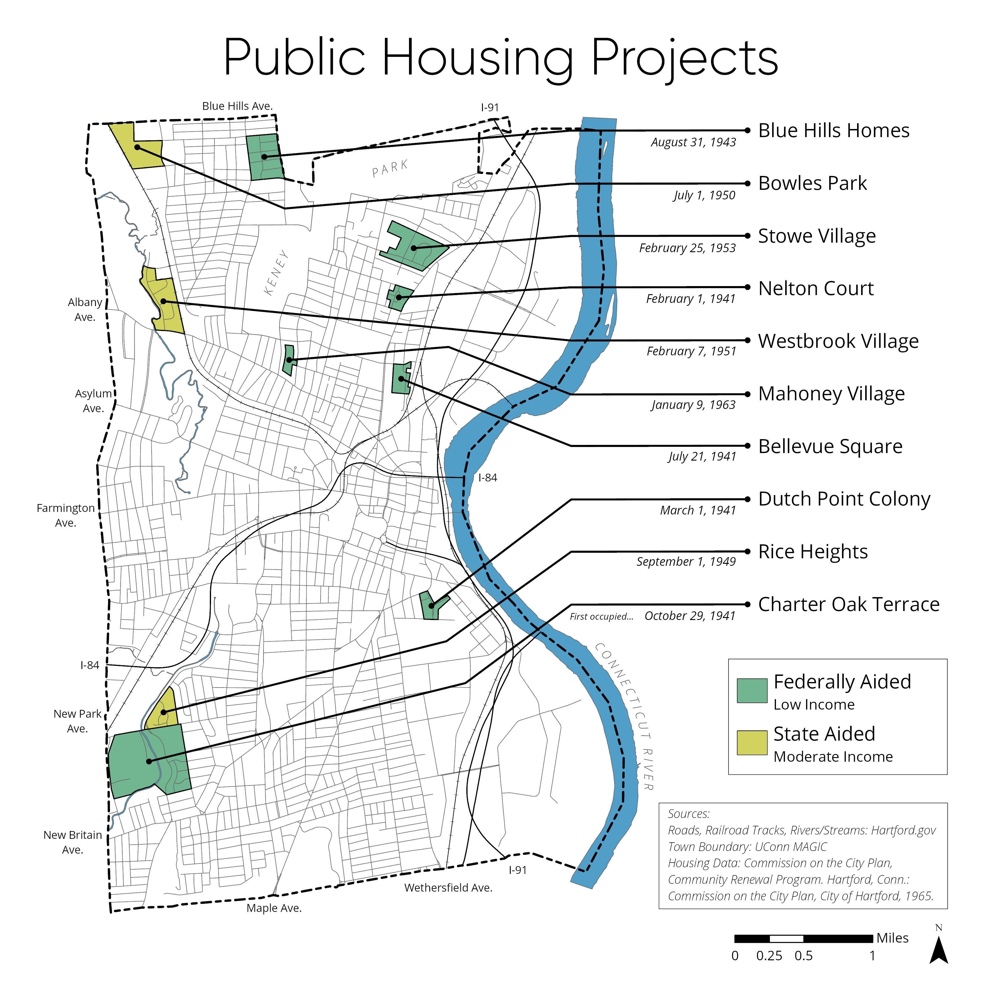

# otl-public-housing
Leaflet interactive historical map of public housing projects in metro Hartford CT

## testing tile sources

- index using raw.githubuser https://ontheline.github.io/otl-public-housing/index.html
- index2 using github pages https://ontheline.github.io/otl-public-housing/index2.html

## Sources
US Library of Congress, “Sanborn Fire Insurance Maps Online Checklist,” https://www.loc.gov/rr/geogmap/sanborn/.

- Hartford volume 1, 1922-1950 https://www.loc.gov/item/sanborn01132_009/
- Hartford volume 2, 1922-1950 https://www.loc.gov/item/sanborn01132_010/ (not yet available as of June 2021).
- Hartford volume 3, 1923-1950 https://www.loc.gov/item/sanborn01132_011/
- Hartford volume 4, 1923-1950 https://www.loc.gov/item/sanborn01132_012/ (not yet available as of June 2021).

Sanborn Map Company, Insurance Maps of Hartford Connecticut (New York: Sanborn Map Co, 1922-1961), images digitized from Connecticut State Library, https://cscu-csl-primo.hosted.exlibrisgroup.com/permalink/f/1aj269h/01CSCU_NETWORK_ALMA7176213960003451.

- https://github.com/ontheline/otl-sanborn-1961-hartford-vol1
- https://github.com/ontheline/otl-sanborn-1961-hartford-vol2
- https://github.com/ontheline/otl-sanborn-1961-hartford-vol3
- https://github.com/ontheline/otl-sanborn-1961-hartford-vol4

See also 2011 Jessica Rivera notes, 2002 Hartford Housing Authority map, and 2020 Greenhouse Studios map, all in this repo.

## File structure
- from LOC download large JPG2000, convert to JPG
- Georeferenced in https://mapwarper.net, and exported XYZ link and GeoTIFF files

### West Hartford
Elmwood Acres (east), labeled USHA Project
- on Sanborn 1950 page 353 https://www.loc.gov/resource/g3784hm.g3784hm_g01132195003/?sp=55
- https://mapwarper.net/maps/tile/57925/{z}/{x}/{y}.png
- 1950-353.tif
- on Sanborn 1961 page 353 (pasted over)

Elmwood Acres (west), labeled USHA Project
- on Sanborn 1950 page 352 https://www.loc.gov/resource/g3784hm.g3784hm_g01132195003/?sp=54
- https://mapwarper.net/maps/tile/57926/{z}/{x}/{y}.png
- 1950-352.tif
- on Sanborn 1961 page 352 (pasted over)

Oakwood Acres, labeled as USHA Project Temporary War Housing
- on Sanborn 1950 page 344 https://www.loc.gov/resource/g3784hm.g3784hm_g01132195003/?sp=46
- https://mapwarper.net/maps/tile/57874/{z}/{x}/{y}.png
- 1950-344.tif
- on Sanborn 1961 page 344 (pasted over)

South Quaker Terrace (north), labeled USHA Project Temporary War Housing
- on Sanborn 1950 page 342 https://www.loc.gov/resource/g3784hm.g3784hm_g01132195003/?sp=44
- https://mapwarper.net/maps/tile/57923/{z}/{x}/{y}.png
- 1950-342.tif

South Quaker Terrace (south), labeled USHA Project Temporary War Housing
- on Sanborn 1950 page 366 https://www.loc.gov/resource/g3784hm.g3784hm_g01132195003/?sp=58
- https://mapwarper.net/maps/tile/57924/{z}/{x}/{y}.png
- 1950-366.tif

Mosaic of five 1950 West Hartford public housing maps above
- https://mapwarper.net/mosaics/tile/1411/{z}/{x}/{y}.png

### Hartford
Airport Homes
- NOT yet in Sanborn map: see Brainard Road area, vacated July 1, 1950, so would be Sanborn 1950 vol 2 (not yet available)
- POSSIBLY cluster of homes in USGS Topographical Map, Hartford South CT, 1944 https://ngmdb.usgs.gov/topoview/viewer/#12/41.6876/-72.6870
- 1944-hartford-south-usgs.jpg

Bowles Park, state housing
- should not appear yet in Sanborn 1950
- Sanborn 1961 page 463 https://github.com/ontheline/otl-sanborn-1961-hartford-vol4

Blue Hills Homes, USHA project?
- Sanborn 1950 page 425 ??? NOT YET AVAILABLE
- Sanborn 1961 page 425 (pasted over) https://github.com/ontheline/otl-sanborn-1961-hartford-vol4

Charter Oak Terrace ABC, labeled USHA project
- Sanborn 1950 page 318 https://www.loc.gov/resource/g3784hm.g3784hm_g01132195003/?sp=19
- https://mapwarper.net/maps/tile/57938/{z}/{x}/{y}.png
- 1950-318.tif
- Sanborn 1961 page 318 https://github.com/ontheline/otl-sanborn-1961-hartford-vol3

Charter Oak Terrace D and Extension (E South), labeled USHA project
- Sanborn 1950 page 326 https://www.loc.gov/resource/g3784hm.g3784hm_g01132195003/?sp=24
- https://mapwarper.net/maps/tile/57941/{z}/{x}/{y}.png
- 1950-326.tif
- Sanborn 1961 page 326 https://github.com/ontheline/otl-sanborn-1961-hartford-vol3

Dutch Point Colony, labeled USHA project
- Sanborn 1950 page 236 ??? NOT YET AVAILABLE
- Sanborn 1961 page 236 https://github.com/ontheline/otl-sanborn-1961-hartford-vol2

Rice Heights, labeled state housing project, and Charter Oak Terrace Extension (E North)
- Sanborn 1950 page 319 https://www.loc.gov/resource/g3784hm.g3784hm_g01132195003/?sp=20
- https://mapwarper.net/maps/tile/57942/{z}/{x}/{y}.png
- 1950-319.tif
- Sanborn 1961 page 319 https://github.com/ontheline/otl-sanborn-1961-hartford-vol3

Westbrook Village, labeled state housing
- will not appear in 1950
- Sanborn 1961 page 462 https://github.com/ontheline/otl-sanborn-1961-hartford-vol4

Bellevue Square, labeled USHA project, 1940-41-42
- Sanborn 1950 page 53 https://www.loc.gov/resource/g3784hm.g3784hm_g01132195001/?sp=68
- Note that 1950 page 54 contains three buildings that are duplicated from page 53
- https://mapwarper.net/maps/tile/57943/{z}/{x}/{y}.png
- 1950-53.tif
- Sanborn 1961 page 53 https://github.com/ontheline/otl-sanborn-1961-hartford-vol1

Mahoney Village
- will not appear in 1950 or 1961 map

Nelton Court, labeled USHA project
- Sanborn 1950 page 65 https://www.loc.gov/resource/g3784hm.g3784hm_g01132195001/?sp=80
- https://mapwarper.net/maps/tile/57944/{z}/{x}/{y}.png
- 1950-65.tif
- Sanborn 1961 page 65 https://github.com/ontheline/otl-sanborn-1961-hartford-vol1

Stowe Village, labeled Housing Authority of the City of Hartford (HHA)
- will not appear in Sanborn 1950
- Sanborn 1961 page 85 https://github.com/ontheline/otl-sanborn-1961-hartford-vol1
- Sanborn 1961 page 86 https://github.com/ontheline/otl-sanborn-1961-hartford-vol1

Smith Towers YEAR?
- not shown in 1961 Sanborn map; see 2002 HHA map

Kent Apartments YEAR?
- not shown in 1961 Sanborn map; see 2002 HHA map

Betty Knox Apartments YEAR?
- not shown in 1961 Sanborn map; see 2002 HHA map

Mary Shepard Place YEAR?
- not shown in 1961 Sanborn map; see 2002 HHA map

## East Hartford

Mayberry Village and extension @FavorsWarHome1944

Pitkin Homes @RulesAreRelaxed1944

United Homes @RulesAreRelaxed1944

Brewer Street Homes @RulesAreRelaxed1944

Norman Homes @RulesAreRelaxed1944

North End Homes @FavorsWarHome1944

## Wethersfield

Westfield Heights @RulesAreRelaxed1944

Westview Homes @FavorsWarHome1944

## Glastonbury

Welles Village @RulesAreRelaxed1944

## Manchester

Orford Village @RulesAreRelaxed1944

Silver Lane Homes @RulesAreRelaxed1944

## Rocky Hill

Drum Hill Park @RulesAreRelaxed1944

## Quick Comparison
1950-1961-oakwoodacres-sanborn.png in otl-bookdown/images

## See also
UConn Greenhouse Studios 2020 visual created by James Kolb for Hartford Housing project [Twitter post](https://twitter.com/GreenhouseUConn/status/1281672946734567425), based on Commission on the City Plan, Community Renewal program, 1965

