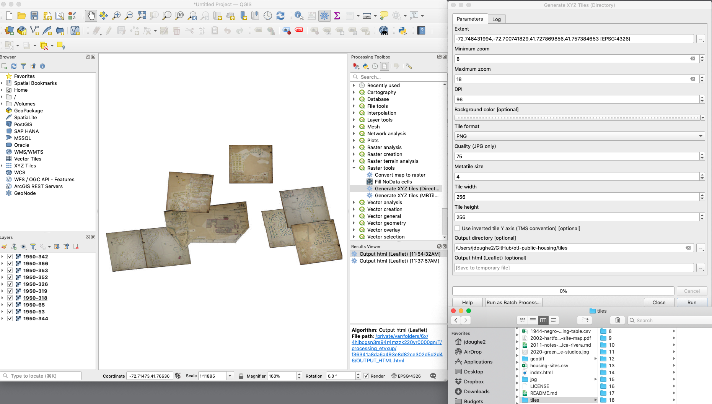
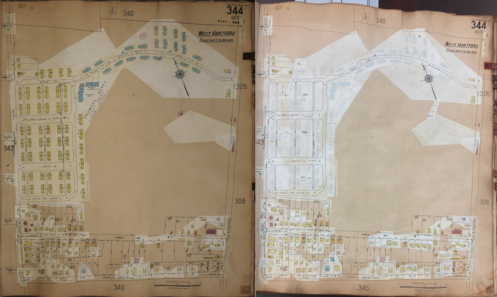

# otl-public-housing
Leaflet interactive historical map of public housing projects in metro Hartford CT

## Tile layer hosted using GitHub Pages on this repo
- live map https://ontheline.github.io/otl-public-housing/index.html
- storymap TO COME

## Data tables
- 1940s-public-housing-projects-race-hartford-county-ct.csv
- focus on WWII-era projects, with partial data on post-war projects
- 1940-census-pre-bellevue-square.csv, to compare racial composition of neighborhood before and after construction of racially segregated public housing project

## Map Georeference methods
1. Obtain map images: download large JPG2000 from LOC, convert to JPG; or download JPG/PNG from other sources. Note that some PNGs from ProQuest Digital Sanborn may need to be converted into a simpler format (JPG?). See Mapwarper warning: "My greyscale image won't work: Try to convert to RGB/Truecolor first and then upload. Often it seems as if images with just one or two bands cause issues"
2. Georeference image in https://mapwarper.net at default WGS84 (because it's easier than QGIS Georeferencer)
3. Export uncropped GeoTIFF for long-term preservation
4. Crop in Mapwarper to focus on public housing project, export cropped GeoTIFF
5. Delete Mapwarper entry (to avoid using it for long-term preservation)
6. Add one or multiple GeoTIFFs as raster layer in QGIS. Keep QGIS Projection EPSG:4326 (WGS84)
7. QGIS Processing > Raster Tools to generate XYZ tiles into `tiles` folder. Be sure to *scroll all the way down* in the QGIS window to designate output folder.
8. Host folder and Leaflet code in repo using GitHub Pages, or choose another server.
9. In the `index.html` file in this repo, see how Leaflet code calls this tile layer URL:
  - https://ontheline.github.io/otl-public-housing/tiles/{z}/{x}/{y}.png
  - Alternative URL to repo without using GitHub Pages:
  - https://raw.githubusercontent.com/OnTheLine/otl-public-housing/main/tiles/{z}/{x}/{y}.png

## Map Sources
Beginning in the 1920s, Sanborn insurance maps were designed to be continuously updated with tissue-paper correction clips that users would paste over existing pages to display changes over time, such as property demolition or new construction. See explanation from Library of Congress: https://guides.loc.gov/fire-insurance-maps/sanborn-interpreting. See example of how Oakwood Acres public housing project in West Hartford appeared on the 1950 map (left) but was torn down in 1954 and removed from the 1961 map (right).

Since Sanborn maps held by libraries reflect different time periods, depending on how long they added correction slips, see date ranges (e.g. 1922-1950 vs. 1922-1961) in the publication years for items below.

US Library of Congress, “Sanborn Fire Insurance Maps Online Checklist,” https://www.loc.gov/rr/geogmap/sanborn/.

- Hartford volume 1, 1922-1950 https://www.loc.gov/item/sanborn01132_009/
- Hartford volume 2, 1922-1950 https://www.loc.gov/item/sanborn01132_010/ (not available online, July 2021).
- Hartford volume 3, 1923-1950 https://www.loc.gov/item/sanborn01132_011/
- Hartford volume 4, 1923-1950 https://www.loc.gov/item/sanborn01132_012/ (not available online, July 2021).

In July 2021, a Geography & Map Division librarian at LOC kindly forwarded my request to make volumes 2 and 4 available online, since they have the same publication dates as volumes 1 and 3. But the librarian and I were perplexed that the Digital Scanning Team at LOC replied that volumes 2 and 4 had not received copyright clearance and would not be shared online in the near future.

Connecticut State Library allowed me to take digital photos of their Sanborn maps, which I hosted on GitHub:

Sanborn Map Company, Insurance Maps of Hartford Connecticut (New York: Sanborn Map Co, 1922-1961), https://cscu-csl-primo.hosted.exlibrisgroup.com/permalink/f/1aj269h/01CSCU_NETWORK_ALMA7176213960003451.

- Hartford volume 1, 1922-1961 https://github.com/ontheline/otl-sanborn-1961-hartford-vol1
- Hartford volume 2, 1922-1961 https://github.com/ontheline/otl-sanborn-1961-hartford-vol2
- Hartford volume 3, 1923-1961 https://github.com/ontheline/otl-sanborn-1961-hartford-vol3
- Hartford volume 4, 1923-1961 https://github.com/ontheline/otl-sanborn-1961-hartford-vol4

CT State Library also provides online access (requires CT State library ID card number) to this extension collection of black and white digital Sanborn maps for many cities and towns across Connecticut. Downloaded here for "non-commercial, non-legal use" in an open-access, educational public history website:

ProQuest, “Digital Sanborn Maps, 1867-1970,” https://libguides.ctstatelibrary.org/az.php?q=sanborn

- East Hartford, 1927-1949
- Manchester, 1926-1949
- New Britain, 1909-1950
- Rocky Hill, 1950
- Wethersfield, 1930-1947

Also, I have requested low-resolution digital images from Sanborn maps held by UConn Archives & Special Collections.

- Wethersfield, 1930-1960 https://uconn-storrs.primo.exlibrisgroup.com/permalink/01UCT_STORRS/1s3ubib/alma9923691953502432
- East Hartford, 1927-1968 https://uconn-storrs.primo.exlibrisgroup.com/permalink/01UCT_STORRS/1s3ubib/alma9923687763502432

Norm Hausmann, “The Development of Mobilization/Wartime Housing in East Hartford, 1940-1943 and Its Impact on the Town” (Student paper for History 839-25, Central Connecticut State University, archived at East Hartford Public Library, August 1998).

- Digital copy sent by EHPL, includes several housing project planning maps, most likely from the East Hartford Housing Authority files.

US Geological Survey, TopoView map viewer, https://ngmdb.usgs.gov/topoview/. Downloaded high-resolution brown-colored maps in GeoTIFF format, uploaded to QGIS, transformed to WGS84 format, clipped to map extent, and resaved as smaller georectified .tif files.

- 1944 Hartford South USGS (for Airport Homes, not shown in any Sanborn map to my knowledge)
- not visible in 1925-1957 Windsor Locks Sanborn
- 1946 Windsor Locks USGS  (TODO for Elm Plains, southwest corner of Elm and South Elm with houses in V formation, not visible in Windsor Locks Sanborn 1925-1957)

## Photo Sources (to come)

## Public Housing Projects

## Hartford

### Airport Homes
- not visible in Sanborn 1950 vol 2 https://digitalsanbornmaps-proquest-com.cslib.idm.oclc.org/about?accountid=58 or in Sanborn 1961
- see cluster of homes near Brainard airport in USGS Topographical Map, Hartford South CT, 1944 https://ngmdb.usgs.gov/topoview/viewer/#12/41.6876/-72.6870
- downloaded 1944-airport-homes-hartford-south-usgs.tif
- opened in QGIS, converted to WGS84, and cropped to map extent
- 1944-airport-homes-usgs-cropped.tif

### Nelton Court
- Sanborn 1950 page 65 https://www.loc.gov/resource/g3784hm.g3784hm_g01132195001/?sp=80
- 1950-nelton-court-65-cropped.tif
- Sanborn 1961 page 65 https://github.com/ontheline/otl-sanborn-1961-hartford-vol1

### Bellevue Square
- Sanborn 1950 page 53 https://www.loc.gov/resource/g3784hm.g3784hm_g01132195001/?sp=68
- Note that 1950 page 54 contains three buildings that are duplicated from page 53, so only use p. 53
- 1950-bellevue-53-cropped.tif
- Sanborn 1961 page 53 https://github.com/ontheline/otl-sanborn-1961-hartford-vol1
- renamed Mary Shepard Place in 2002 HHA map

### Dutch Point Colony
- Sanborn 1950 page 236 https://digitalsanbornmaps-proquest-com.cslib.idm.oclc.org/browse_maps/7/1131/4913/5195/74613?accountid=58
- Sanborn 1961 page 236 https://github.com/ontheline/otl-sanborn-1961-hartford-vol2
- 1961-dutchpoint-236-cropped.tif

### Charter Oak Terrace and Extension
- Sanborn 1950 page 318 (sections ABC) https://www.loc.gov/resource/g3784hm.g3784hm_g01132195003/?sp=19
- 1950-charteroak-abc-318-cropped.tif
- Sanborn 1961 page 318 (sections ABC) https://github.com/ontheline/otl-sanborn-1961-hartford-vol3

- Sanborn 1950 page 326 (section D and Extension south) https://www.loc.gov/resource/g3784hm.g3784hm_g01132195003/?sp=24
- 1950-charteroak-desouth-326-cropped.tif
- Sanborn 1961 page 326 https://github.com/ontheline/otl-sanborn-1961-hartford-vol3

- Sanborn 1950 page 319 (Extension north, see also Rice Heights) https://www.loc.gov/resource/g3784hm.g3784hm_g01132195003/?sp=20
- 1950-charteroak-enorth-319-cropped.tif

### Rice Heights and Extension
- Sanborn 1950 page 319 https://www.loc.gov/resource/g3784hm.g3784hm_g01132195003/?sp=20
- 1950-riceheights-319-cropped.tif
- Note: Cannot easily georectify the tiny north tip with the rest of the map, so omitted from cropped.tif
- Sanborn 1961 page 319 https://github.com/ontheline/otl-sanborn-1961-hartford-vol3

### Blue Hills Homes
- Sanborn 1950 page 425 https://digitalsanbornmaps-proquest-com.cslib.idm.oclc.org/browse_maps/7/1131/4913/5197/74757?accountid=58
- 1950-bluehillshomes-425-bw-cropped.tif
- Sanborn 1961 page 425 (same homes, text pasted over) https://github.com/ontheline/otl-sanborn-1961-hartford-vol4

### Stonington Street temporary
- Sanborn 1950 page 236 https://digitalsanbornmaps-proquest-com.cslib.idm.oclc.org/browse_maps/7/1131/4913/5195/74613?accountid=58
- 1950-stonington-236-bw-cropped.tif

- Sanborn 1961 page 236 covered up

### Barbour St temporary
- Sanborn 1950 page 85 https://digitalsanbornmaps-proquest-com.cslib.idm.oclc.org/browse_maps/7/1131/4913/5194/74568?accountid=58

### Bowles Park
- Sanborn 1961 page 463 https://github.com/ontheline/otl-sanborn-1961-hartford-vol4

### Westbrook Village
- Sanborn 1961 page 462 https://github.com/ontheline/otl-sanborn-1961-hartford-vol4

### Stowe Village
- Sanborn 1961 (west) page 85 https://github.com/ontheline/otl-sanborn-1961-hartford-vol1
- Sanborn 1961 (east) page 86 https://github.com/ontheline/otl-sanborn-1961-hartford-vol1

### Mahoney Village
- will not appear in 1950 or 1961 map

### Smith Towers YEAR?
- not shown in 1961 Sanborn map; see 2002 HHA map

### Kent Apartments YEAR?
- not shown in 1961 Sanborn map; see 2002 HHA map

### Betty Knox Apartments YEAR?
- not shown in 1961 Sanborn map; see 2002 HHA map

## West Hartford

### Elmwood Acres
- on Sanborn 1950 page 353 (east) https://www.loc.gov/resource/g3784hm.g3784hm_g01132195003/?sp=55
- 1950-elmwoodacres-east-353-cropped.tif
- on Sanborn 1961 page 353 (text pasted over, same homes)

- on Sanborn 1950 page 352 (west) https://www.loc.gov/resource/g3784hm.g3784hm_g01132195003/?sp=54
- 1950-elmwoodacres-west-352-cropped.tif
- on Sanborn 1961 page 352 (pasted over, same homes)

### Oakwood Acres
- on Sanborn 1950 page 344 https://www.loc.gov/resource/g3784hm.g3784hm_g01132195003/?sp=46
- 1950-oakwoodacres-344-cropped.tif
- on Sanborn 1961 page 344 (pasted over)

### South Quaker Terrace
- on Sanborn 1950 page 342 (north) https://www.loc.gov/resource/g3784hm.g3784hm_g01132195003/?sp=44
- 1950-southquakerterrace-north-342.tif
- on Sanborn 1950 page 366 (south) https://www.loc.gov/resource/g3784hm.g3784hm_g01132195003/?sp=58
- 1950-southquakerterrace-south-366.tif

## East Hartford

Also: Requested Sanborn 1968 color pages from UConn Archives July 2021

Mayberry Village and Extension
- 1940s-mayberry-eh-hausmann.pdf probably from EHHA
- page 35 Sanborn EH 1949 Mayberry Village and Extension, Cannon Road
- page 36 Sanborn EH 1949 Mayberry Village (continued)

Pitkin Homes
- 1940s-pitkin-eh-hausmann.pdf probably from EHHA
- does not appear in page 4 Sanborn EH 1949, but correct streets appear on page 1 key
- Streets: Dike Circle, Florence St Ext, Meadow St, Hartland St, Eddison and Hooker St; Source: East Hartford History: A Look Back, public Facebook group, https://x.facebook.com/groups/174504256076803?bac=MTYxNDkxMDM2ODoxNTQ2MjAzNTQ4OTA2ODYwOjE1NDYyMDM1NDg5MDY4NjAsMCwxOjIwOkt3PT0%3D&multi_permalinks

United Homes
- page 27 Sanborn EH 1949 United Homes US Temporary Housing, S Main and Ayr (across from Lilac)
- page 28 Sanborn EH 1949 United Homes (continued) S Main and Ayr, near Coca Cola Bottling

Brewer Street Homes
- 1940s-brewer-eh-hausmann.pdf probably from EHHA
- page 30 Sanborn EH 1949 Brewer Street Homes, temporary federal housing, Hamilton Road near Brewer St

North End Homes
- 1940s-northend-eh-hausmann.pdf probably from EHHA
- page 40 Sanborn EH 1949 North End Homes federal housing project, Rogers Road and Remington Road

Norman Homes
- 1940s-norman-eh-hausmann.pdf from EHHA
- page 30 Sanborn EH 1949 Norman Homes, temporary federal housing, Norman Road and High Ave

Riverside Trailers
- 1940s-riversidetrailer-eh-hausmann.pdf, probably from EHHA
- not on Sanborn 1949, but probably around page 4 near Pitkin Homes?

## Wethersfield

Also requested Sanborn 1960 color pages from UConn Archives July 2021

### Westfield Heights
- page 18 partial Sanborn 1947
- 130-unit "Westfield Heights has successfully become an integrated part of the Wethersfield community, instead of remaining a "project," said Edward Adams, executive director of the Wethersfield Housing Authority" @ClubHearsAdams1945

### Highview Homes
- does not appear in Sanborn 1947, but would be on page 4
- 14 duplexes for 28 units, probably on Highview Ave, Oxford St, Holbrook Terrace, based on Google Map street view
- 1948 state bonds approved for 28 units moderate rental housing in Wethersfield @BondApplicationWethersfield1948
- initially named "Highvue" veteran's development near Wolcott Hill Road and Oxford Street
- feature story with photos @WethersfieldProjectHas1949
- listed as "Highview Terrace" 28 units in https://www.cga.ct.gov/2014/rpt/2014-R-0194.htm
"In 1943 the Westfield Heights housing project was built to provide low-cost housing for those working in the defense industries in the greater Hartford area, and at the end of the war preference was given to returning veterans.  In 1947-48 the Highview housing project was built to provide more homes for veterans.  Both of these projects were built with Federal Public Housing Authority funds." @wiederTwentiethCenturyWethersfield1985

## Rocky Hill

Drum Hill Park
- supervised by Wethersfield Housing Authority @HousingAuthorityGiven1943
- page 7 Sanborn 1950 Rocky Hill

## Glastonbury

### Welles Village
- NOT in digital Sanborn (most recent year 1939)
- 1946 Glastonbury CT USGS https://ngmdb.usgs.gov/topoview/viewer/#14/41.7018/-72.6013
- 200 units of single and duplex houses @WarHousingProjects1943; one-third occupied by July 1943 @PurtillManagerProject1943; all but 7 units occupied Sept 1943
- photo uploaded and story @DeafMuteWar1943; @WarWorkerHousing1943
- http://www.glastha.org/programs.htm

## Manchester

### Orford Village
- pages 10 and 45 Sanborn 1949 Manchester

### Silver Lane Homes
- page 45 Sanborn 1949 Manchester

## Windsor Locks
### Elm Plains
- not visible in 1925-1957 Windsor Locks Sanborn
- visible in 1946 Windsor Locks USGS (southwest corner of Elm and South Elm, with houses in V formation)
- seeking clarity about Elm Plains versus Elm Plains extension, and whether one or both were "temporary"
- 85 units single and duplex homes; built 1942
- "Soon a cluster of small homes called Elm Plains was built at the intersection of Elm and South Elm streets. What was supposed to be temporary housing still stands, now under the name Elm Corners." @churchLookHistoryBradley2014
- after 1955 eviction struggle, govt planned to demolish units and nearly all vacated (were these barracks?) @AllThreeVacate1955
- but 77 tenants in 85 units expressed interest in buying dwellings @ResidentsSlateSurvey1956

## Berlin
- no public housing projects in Sanborn 1927-1944 map

## Bristol

### Victory Heights
- sold to out-of-town speculator around 1955

## New Britain

### Ledgecrest

### Mount Pleasant

### Osgood Heights

### Rockland Housing Project
- Lowell St in 1944; former project by 1966
- but Lowell St is not visible in

Cecilia Wallace says
MAY 10, 2020 AT 8:59 PM
I grew up in the old Rockland Housing Project on Rocky Hill Avenue,(which was built to house the defense workers who came to work at the factories.)

### Sunvale Manor

### White Oaks

## Plainville

### East Mountain Terrace
- probably managed by New Britain Housing Authority
- not listed in Plainville 1931-1942 Sanborn map

## Major Defense Factories

### Niles-Bement-Pond Co., Pratt & Whitney Division, West Hartford
- factory-1950-prattwhitney-wh-366-cropped.tif

### Colt Industrial Park, Hartford
- factory-1961-colt-222-cropped.tif

### Pratt & Whitney Aircraft, East Hartford
- TODO

## Additional notes in repo

- 2002 Hartford Housing Authority map
- 2011 Jessica Rivera notes
- [2020 UConn Greenhouse Studios map created by James Kolb for Hartford Housing project](https://twitter.com/GreenhouseUConn/status/1281672946734567425), based on Commission on the City Plan, Community Renewal program, 1965
